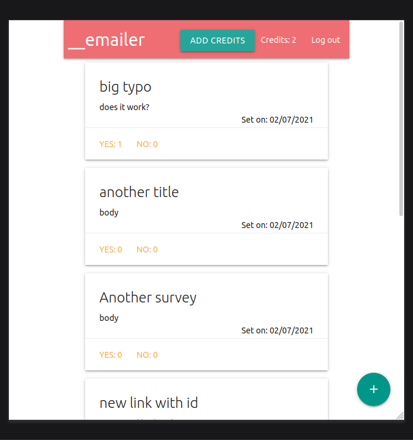

# __emailer

## Table of contents

* [General info](#general-info)
* [Screenshot](#screenshot)
* [Technologies](#technologies)
* [Setup](#setup)
* [Features](#features)
* [Status](#status)
* [Inspiration](#inspiration)
* [Contact](#contact)

## General info

I wanted to be more proficient at building, developing and creating production mode for react app connected with my own back end server. And not just that I wanted to be able to send form data, send emails, charge people, allow them to log in and access database as well as creating new entries and gather info from links people clicked in my emails. As it turned out I managed to find udemy course which taught just that.

## Screenshot



## Technologies

* sendgrid - version 5.2.3
* @sendgrid/mail - version 7.4.4
* @reduxjs/toolkit - version 1.6.0
* body-parser - version 1.19.0
* concurrently - version 6.0.2
* cookie-session - version 1.4.0
* express - version 4.17.1
* lodash - version 4.17.21
* mongoose - version 5.12.5
* passport - version 0.4.1
* passport-google-oauth20 - version 2.0.0
* path-parser - version 6.1.0
* redux-form - version 8.3.7
* stripe - version 8.148.0

## Setup

In order to set up project locally, after downloading, you will notice there are two package.json files inside this project, one for fronend react, one for backend node server, both will require installing their dependencies.
Once thats done you will need to create a `dev.js` file inside `config` folder. in this file you will need to create object:

```javascript
module.exports = {
    googleClientID:          YOUR_UNIQ_KEY,
    googleClientSecret:      YOUR_UNIQ_KEY,
    mongoURI:                YOUR_UNIQ_KEY,
    cookieKey:               YOUR_UNIQ_KEY,
    stripePublishableKey:    YOUR_UNIQ_KEY,
    stripeSecretKey:         YOUR_UNIQ_KEY,
    sendGridKey:             YOUR_UNIQ_KEY,
    redirectDomain:'http://localhost:3000',
}
```

Where `YOUR_UNIQ_KEY` is the key you obtain from your accounts with corresponding providers: mongoDB. google, stripe, send grid, whereas `cookieKey` can be any random set of your own characters in form of string. Then in new terminal run command `npx ngrok http 5000` this will proviedd you with two web addresses, then go to [https://app.sendgrid.com/settings/mail_settings](https://app.sendgrid.com/settings/mail_settings), click on __edit__ button next to __event webhook__ and paste one of the web addresses provided from __ngrok__, adding at th end `/api/surveys/webhooks` so your whole web address will look like `https://2b74e8dc90f9.ngrok.io/api/surveys/webhooks`.
Once all of the above is done you can run command 'npm run dev' inside project's root folder. Log in with your google account, add credits yousing stripe, which is in testing mode and will accept a card with number 4242 4242 4242 4242 with any future axpiry date and any security code. Then click on __emailer logo and on bit __+__ button to create and send new survey.

## Features

List of ready features

* can login with __google__ accounts, creating profile/loging in to existing profile
* can buy credits using __stripe__
* can make simple form with one question and one set of either yes or no answers
* can send said form to a list of coma separated emails
* can collect votes from recepients and display it on dashboard to form creator
* charges one token per campain

## Status

Project is completed but not deployed on heroku, I've learned all I wanted from this course, and I don't feel like creating such service as viable business

## Inspiration

Project based on [Node with React: Fullstack Web Development](https://www.udemy.com/course/node-with-react-fullstack-web-development/learn/lecture/24616618?start=1#overview) __Udemy__ course

## Contact

Created by __gregkozdroj@gmail.com__, feel free to contact me.
